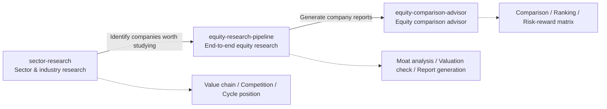

[中文](./README.md) · **English**

# Investment Research Skills

#### Agent Skills for investment research workflows

[](./LICENSE)
[](#-skills)
[](https://agentskills.io)


This repository collects reusable Agent Skills for investment research. Each skill is a standalone structured instruction set that follows the [Agent Skills](https://agentskills.io) open format and can be loaded by clients that support `SKILL.md`.

The current skills are Chinese-first and designed for company research, industry entry-barrier analysis, moat testing, competitor attack simulation, and financial/business-model validation.

---

## Index

| Name | One-liner |
| --- | --- |
| [**investment-research (Master Entry)**](#-investment-research) | Automatic intent recognition and routing to the correct sub-skill — no need to memorize sub-skill names |
| [**RULES.md**](./RULES.md) | Global shared rules: output formatting, evidence discipline, prohibited advice, quality checklist |
| [**routing.md**](./routing.md) | Intent → skill routing matrix |
| [**sector-research**](#-sector-research) | Analyze industry value chain, competitive landscape, cycle position, and investment opportunities — upstream of the research chain |
| [**company-moat-research**](#-company-moat-research) | Analyze company moats and industry entry barriers from new entrant, industry researcher, and long-term investor perspectives |
| [**valuation-expectation-check**](#-valuation-expectation-check) | Check the market expectations, valuation risk, and validation metrics implied by the current stock price |
| [**integrated-equity-research-report**](#-integrated-equity-research-report) | Merge moat research, valuation checks, and other investment materials into a standardized Markdown research report |
| [**equity-research-pipeline**](#-equity-research-pipeline) | One command to run moat research, valuation check, and report generation end-to-end |
| [**equity-comparison-advisor**](#-equity-comparison-advisor) | Compare multiple company reports, rank candidates, and build a decision framework |

---

## Install

### Codex

```bash
git clone git@github.com:vampire-locker/investment-research-skills.git
mkdir -p ~/.codex/skills/investment-research-skills
cp -R investment-research-skills/* ~/.codex/skills/investment-research-skills/
```

### Claude Code

```bash
git clone git@github.com:vampire-locker/investment-research-skills.git
mkdir -p ~/.claude/skills/investment-research-skills
cp -R investment-research-skills/* ~/.claude/skills/investment-research-skills/
```

Once installed, describe your research need in natural language. The routing system will dispatch to the correct sub-skill automatically:

- "Analyze NVIDIA" → end-to-end research pipeline
- "What's the EV battery value chain like?" → sector research
- "Compare the Magnificent Seven" → equity comparison

---

## Workflow

These skills can be used independently or as a complete three-stage research chain: screen sectors first, generate company reports, then compare across companies.

`company-moat-research`, `valuation-expectation-check`, and `integrated-equity-research-report` can each be called independently. They are also orchestrated internally by `equity-research-pipeline` — give it a company name and it runs all three in sequence.



---

## ✨ Skills

<a id="investment-research"></a>

### Master Entry · investment-research

> *"Analyze NVIDIA" — one sentence, automatically routed to the correct analysis pipeline.*

The master entry is the unified trigger point for the investment research skill system. Once installed, simply describe your research need in natural language. The system automatically recognizes keywords and intent, then routes to the appropriate sub-skill.

**Responsibilities**

- Intent recognition: determine whether the user wants sector research, company research, valuation checks, or cross-company comparison.
- Shared rule loading: read RULES.md to ensure all sub-skills consistently follow output formatting, evidence discipline, and prohibited-advice rules.
- Pre-completion quality checks: all analyses must pass a checklist before claiming "done".

→ [SKILL.md](./SKILL.md) · [RULES.md](./RULES.md) · [routing.md](./routing.md)

---

### sector-research

> *"How does this sector look? Which segments deserve the most attention? Where are profit pools shifting?"*

This skill does investment research at the sector/industry level, answering questions about value chain structure, competitive dynamics, cycle positioning, and which segments deserve priority research. It has a clear division of labor with `company-moat-research`: `sector-research` picks the sector, `company-moat-research` picks the companies.

**It focuses on**

- Market size, lifecycle stage, and core growth drivers.
- Value chain structure, profit allocation, and profit migration trends.
- Competitive landscape, concentration, and evolution direction.
- Technology roadmap and substitution risks.
- Policy, regulation, and ESG environment.
- Cycle positioning and key risk inventory.

**Good for**

- Value chain mapping and sector screening
- Industry cycle assessment
- Technology roadmap comparison
- Policy environment evaluation
- Identifying segments and company types worth deeper research

**How to trigger**

```text
Analyze China's NEV power battery value chain — which segment has the strongest profit pool and competitive position.

How does the global semiconductor equipment sector look? Assess cycle position and competitive landscape.

Analyze the AI data center infrastructure sector. What's the most interesting segment over the next three years?
```

→ [SKILL.md](./sector-research/SKILL.md) · [Research framework](./sector-research/references/research-framework.md)

### company-moat-research

> *"If I were a well-funded and highly capable new entrant, could I challenge this company from zero?"*

This skill helps analyze a company through its real business system. Instead of directly saying whether the company is good or bad, it asks how the company makes money, where a new entrant would get stuck, how competitors could attack it, and whether its advantages can turn into durable profit and cash flow.

**It analyzes from three perspectives**

- **Entrepreneur / competitor**: where a new entrant would get blocked.
- **Industry researcher**: the industry's scarce resources, control points, and profit pools.
- **Long-term investor**: whether the company has a durable moat worth tracking over time.

**Good for**

- Company research memos
- Industry entry-barrier analysis
- Moat pressure testing
- Competitor attack simulation
- Financial and business-model validation
- Long-term tracking metrics

**How to trigger**

```text
Analyze NVIDIA's AI data center infrastructure moat.

Look at Sandisk — focus on NAND entry barriers, data center SSD opportunities, and long-term holding conditions.

Analyze Costco using the moat framework. Assume I am a new entrant trying to challenge it in five years.
```

→ [SKILL.md](./company-moat-research/SKILL.md) · [Research framework](./company-moat-research/references/research-framework.md)

### valuation-expectation-check

> *"Based on the previous analysis, how should we think about the current stock price?"*

This skill maps company research, industry research, earnings analysis, or moat analysis to the current stock price and valuation expectations. It does not answer whether to buy or sell. Instead, it breaks down what expectations are embedded in the current price, whether those expectations match the fundamentals, and which variables could drive a re-rating or de-rating.

**It focuses on**

- Growth, margin, and cash-flow expectations implied by current valuation.
- Whether those expectations match the underlying business analysis.
- What the market has likely priced in and what may still be underappreciated.
- What data could support further re-rating or trigger de-rating.
- The most important follow-up indicators.

**Good for**

- Follow-up stock price questions after company research
- Post-earnings valuation reassessment
- Valuation expectation checks for growth, cyclical, platform, and asset-heavy companies
- Market-implied expectation analysis
- Risk/reward framing

**How to trigger**

```text
What market expectations are implied by NVIDIA's current stock price? Don't give buy/sell advice.

Based on the Sandisk analysis, does the current price already reflect NAND strength? Please only break down expectations and validation metrics.

Is this company's valuation expensive? Break down market expectations and key indicators.
```

→ [SKILL.md](./valuation-expectation-check/SKILL.md) · [Valuation framework](./valuation-expectation-check/references/valuation-framework.md)

### integrated-equity-research-report

> *"Turn the previous research into a Markdown report that can be archived."*

This skill merges moat research, valuation expectation checks, earnings analysis, or other investment research materials into a standardized Markdown research report with stable headings and clear evidence classification. It does not redo company analysis or valuation work; it deduplicates, compresses, standardizes, and preserves conclusions.

**It focuses on**

- Merging outputs from `company-moat-research` and `valuation-expectation-check`.
- Standardizing Markdown report headings, order, and metadata.
- Preserving confirmed facts, reasoned inferences, and assumptions to verify.
- Removing repeated sections while connecting moat conclusions with valuation expectations.
- Producing a formal research report suitable for archiving.

**Good for**

- Archiving multi-turn company research
- Organizing investment memos
- Standardizing outputs from different agents
- Combining moat analysis and valuation expectation checks
- Generating Markdown research reports

**How to trigger**

```text
Turn the previous Tencent moat analysis and valuation check into a Markdown research report.

Generate a standardized company research report from these materials. Do not give buy/sell advice.
```

→ [SKILL.md](./integrated-equity-research-report/SKILL.md) · [Report template](./integrated-equity-research-report/references/report-template.md)

### equity-research-pipeline

> *"Analyze Microsoft" — one sentence, complete research report.*

This skill chains moat research, valuation expectation checks, and report generation into a single end-to-end pipeline. Provide a company name and it runs all three steps in sequence, producing an archivable Markdown research report.

**It runs these steps in order**

1. **Moat research**: analyze business boundaries, industry barriers, moat sources, business model, and financial quality.
2. **Valuation check**: fetch the latest stock price, break down market-implied expectations, and compare them against the moat analysis.
3. **Report generation**: merge both analyses into a standardized Markdown research report.

**Good for**

- Quickly bootstrapping a company research archive
- Simplifying multi-step research workflows
- Batch-generating standardized research reports
- Situations where you don't want to trigger three separate skills manually

**How to trigger**

```text
Analyze Microsoft end-to-end.

Research TSMC and save the report to ~/research/.

Run the full research pipeline for NVIDIA and produce a complete report.
```

→ [SKILL.md](./equity-research-pipeline/SKILL.md)

### equity-comparison-advisor

> *"Across these research reports, which companies deserve priority research or allocation?"*

This skill reads multiple company research reports, extracts comparable fields, and produces table-first comparisons, rankings, risk-reward matrices, and conditional allocation frameworks. It is designed to run after `equity-research-pipeline` has generated reports for a group of companies.

**It focuses on**

- Summarizing business quality, growth certainty, valuation pressure, risk level, and expectation gaps across companies.
- Presenting conclusions through tables, ranking grids, and risk-reward matrices.
- Framing conditional suggestions such as priority research, staged allocation, waiting for valuation digestion, small-position observation, or watchlist only.
- Listing buy, wait, and reassessment conditions.
- Preserving data dates and evidence boundaries while avoiding unconditional buy/sell calls.

**Good for**

- Comparing the Magnificent Seven or other peer groups
- Summarizing multiple Markdown research reports
- Ranking portfolio candidates
- Building risk-reward matrices and investor-type matching
- Defining buy conditions, wait signals, and risk signals

**How to trigger**

```text
Compare the Magnificent Seven reports under ~/research/magnificent-seven.

Based on these reports, which companies deserve priority research and which should wait for valuation digestion?

Produce table-based rankings, a risk-reward matrix, and buy-condition tables.
```

→ [SKILL.md](./equity-comparison-advisor/SKILL.md) · [Comparison framework](./equity-comparison-advisor/references/comparison-framework.md)

---

## Repository Layout

```text
investment-research-skills/
├── SKILL.md                          ← Master entry, keyword routing
├── RULES.md                          ← Global shared rules
├── routing.md                        ← Intent → skill routing matrix
├── README.md
├── README.en.md
├── LICENSE
├── sector-research/
│   ├── SKILL.md
│   ├── agents/
│   │   └── openai.yaml
│   └── references/
│       └── research-framework.md
├── company-moat-research/
│   ├── SKILL.md
│   ├── agents/
│   │   └── openai.yaml
│   └── references/
│       └── research-framework.md
├── valuation-expectation-check/
│   ├── SKILL.md
│   ├── agents/
│   │   └── openai.yaml
│   └── references/
│       └── valuation-framework.md
├── integrated-equity-research-report/
│   ├── SKILL.md
│   ├── agents/
│   │   └── openai.yaml
│   └── references/
│       └── report-template.md
├── equity-research-pipeline/
│   ├── SKILL.md
│   └── agents/
│       └── openai.yaml
└── equity-comparison-advisor/
    ├── SKILL.md
    ├── agents/
    │   └── openai.yaml
    └── references/
        └── comparison-framework.md
```

---

## Contributing

Contributions are welcome. Suggested conventions:

- Keep each skill in its own directory.
- Every skill should include at least `SKILL.md`.
- Put detailed frameworks under `references/`.
- Do not commit `.DS_Store`, temporary files, private research materials, or unauthorized data.

---

[MIT License](./LICENSE) · Free to use, modify, and redistribute
