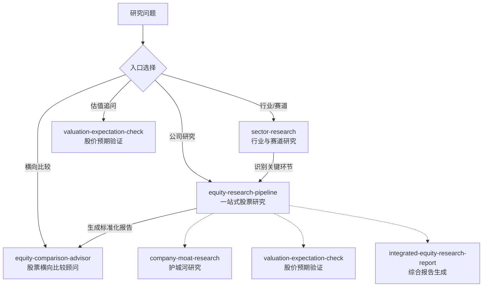

**中文** · [English](./README.en.md)

# Investment Research Skills

#### 投资研究用的 Agent Skills 集合

[](./LICENSE)
[](#-skills)
[](https://agentskills.io)


这里收集的是投资研究场景下可复用的 Agent Skills。它是一个整体安装的 skill 体系，总入口 `investment-research` 自动根据用户意图路由到行业研究、公司护城河分析、股价预期验证、综合报告生成或横向比较等子技能。各子技能遵循 [Agent Skills](https://agentskills.io) 开放格式。

当前仓库以中文研究输出为主，适合公司研究、行业壁垒分析、护城河判断、竞争对手攻击模拟、财务与商业模式验证等场景。

---

## 目录

| 名字 | 一句话 |
| --- | --- |
| [**investment-research（总入口）**](#investment-research) | 自动识别研究意图，路由到对应的子技能，无需记忆子技能名称 |
| [**RULES.md**](./RULES.md) | 全局共享规则：输出格式、证据纪律、禁止事项、质量检查 |
| [**routing.md**](./routing.md) | 意图→技能路由矩阵 |
| [**01 · sector-research（行业与赛道研究）**](#sector-research) | 分析行业产业链结构、竞争格局、周期位置和投资机会，定位研究链路上游 |
| [**02 · company-moat-research（公司护城河研究）**](#company-moat-research) | 从新进入者、产业研究员、长期投资者三个视角拆解公司护城河和行业进入壁垒 |
| [**03 · valuation-expectation-check（股价预期验证）**](#valuation-expectation-check) | 检查当前股价隐含的市场预期、兑现难度、估值风险和后续验证指标 |
| [**04 · integrated-equity-research-report（综合股票研究报告）**](#integrated-equity-research-report) | 将护城河研究、估值预期验证和其他投资材料合并成统一格式的 Markdown 研究报告 |
| [**05 · equity-research-pipeline（一站式股票研究）**](#equity-research-pipeline) | 一条指令完成护城河研究、股价预期验证和综合报告生成 |
| [**06 · equity-comparison-advisor（股票横向比较顾问）**](#equity-comparison-advisor) | 对多家公司研究报告做横向比较、排序和配置决策辅助 |

---

## 安装

### Codex

```bash
git clone git@github.com:vampire-locker/investment-research-skills.git
mkdir -p ~/.codex/skills/investment-research-skills
cp -R investment-research-skills/* ~/.codex/skills/investment-research-skills/
```

### Claude Code

```bash
git clone git@github.com:vampire-locker/investment-research-skills.git
mkdir -p ~/.claude/skills/investment-research-skills
cp -R investment-research-skills/* ~/.claude/skills/investment-research-skills/
```

安装后无需记忆子技能名称，用自然语言描述需求即可自动路由：

- "帮我分析一下宁德时代" → 走一站式研究流水线
- "动力电池产业链，哪个环节最值得关注" → 走行业研究
- "对比一下七姐妹，谁更值得优先研究" → 走横向比较

---

## 工作流

安装后只需用自然语言描述研究需求，总入口自动识别意图并路由到对应子技能。常见场景：

| 研究问题 | 自动路由到 | 典型输出 |
| --- | --- | --- |
| 想先看一个行业或赛道值不值得研究 | `sector-research` | 产业链结构、利润分布、竞争格局、周期位置、值得深入研究的环节 |
| 已经有目标公司，想做一份完整研究报告 | `equity-research-pipeline` | 数据基线、护城河研究、估值预期验证、统一 Markdown 报告 |
| 只想拆解一家公司的护城河或进入壁垒 | `company-moat-research` | 业务边界、行业进入难点、护城河来源、失效条件、跟踪指标 |
| 已有公司研究，想看当前股价隐含了什么 | `valuation-expectation-check` | 市场隐含预期、兑现难度、重估/杀估值条件、后续验证指标 |
| 已有多家公司报告，想做横向排序或配置辅助 | `equity-comparison-advisor` | 横向总览、评分排序、风险收益矩阵、买入/等待/再评估条件 |

最常见的完整链路是：

1. 用自然语言描述行业研究需求，触发 `sector-research` 从行业层面确定值得关注的公司类型。
2. 对候选公司逐一提供名称，触发 `equity-research-pipeline` 生成标准化研究报告。
3. 当积累了多份公司报告后，触发 `equity-comparison-advisor` 做横向比较和优先级排序。

如果已经明确目标公司，可以跳过行业研究，直接提供公司名称即可跑完整个单家公司研究流程。



---

## ✨ Skills

<a id="investment-research"></a>

### 总入口 · investment-research

> *"帮我分析一下宁德时代"——一句话，自动路由到正确的分析流程。*

总入口是投资研究技能体系的统一触发点。安装后只需在对话中描述研究需求，系统自动根据关键词和意图路由到对应的子技能，无需记忆 6 个子技能的名称。

**它负责**

- 意图识别：判断用户要的是行业研究、公司研究、估值验证还是横向比较。
- 共享规则加载：读取 RULES.md，确保所有子技能统一遵守输出格式、证据纪律和禁止事项。
- 完成前质量检查：所有分析在声称"完成"前必须逐项打勾。

→ [SKILL.md](./SKILL.md) · [RULES.md](./RULES.md) · [routing.md](./routing.md)

---

<a id="sector-research"></a>

### Skill 01 · sector-research（行业与赛道研究）

> *"这个赛道整体如何？哪个环节最值得关注？产业链利润往哪里走？"*

这个 skill 负责从行业/赛道层面做投资研究，回答"产业链结构""竞争格局""周期位置""值得优先研究的环节"等问题。它和 `company-moat-research` 分工明确：`sector-research` 选赛道，`company-moat-research` 挑公司。

**它会重点分析**

- 行业规模、阶段和核心驱动力。
- 产业链结构、价值分配和利润转移趋势。
- 竞争格局、集中度和格局演化方向。
- 技术路线和替代风险。
- 政策、监管和 ESG 环境。
- 周期位置和主要风险清单。

**适合**

- 产业链梳理和赛道选择
- 行业景气周期判断
- 技术路线比较
- 政策环境评估
- 确定值得深入研究的环节和公司类型

**怎么触发**

```text
分析中国新能源车动力电池产业链，看哪个环节利润最厚、格局最好。

全球半导体设备赛道怎么样？判断一下周期位置和竞争格局。

AI 数据中心基础设施这个赛道，未来 3 年最值得关注的环节是什么。
```

→ [SKILL.md](./sector-research/SKILL.md) · [研究框架](./sector-research/references/research-framework.md)

---

<a id="company-moat-research"></a>

### Skill 02 · company-moat-research（公司护城河研究）

> *“如果我是一个资金充足、执行力很强的新进入者，能不能从 0 开始挑战这家公司？”*

这个 skill 用来研究一家公司所在的行业或细分业务。它不会直接判断“好不好”，而是先把公司放回真实业务系统里，拆解它靠什么赚钱、行业从 0 做起来会卡在哪里、竞争对手怎么进攻，以及这些优势能不能转化为长期利润和现金流。

**它会从三个视角分析**

- **创业者 / 竞争对手**：如果从 0 做同样的生意，最难突破哪些环节。
- **产业研究员**：行业真正的关键资源、稀缺能力和利润来源是什么。
- **长期投资者**：公司是否具备可持续护城河，是否值得长期跟踪或长期持有。

**适合**

- 公司研究和投资备忘录
- 行业进入壁垒分析
- 护城河压力测试
- 竞争对手攻击模拟
- 财务和商业模式验证
- 长期跟踪指标梳理

**怎么触发**

```text
分析英伟达的护城河——如果我是一个资金充足的新进入者，能不能从 0 开始挑战它？

看看闪迪的 NAND 行业进入壁垒、数据中心 SSD 机会和长期持有条件。

用护城河框架分析 Costco，假设我是新进入者，未来 5 年想挑战它。
```

→ [SKILL.md](./company-moat-research/SKILL.md) · [研究框架](./company-moat-research/references/research-framework.md)

---

<a id="valuation-expectation-check"></a>

### Skill 03 · valuation-expectation-check（股价预期验证）

> *“根据前面的分析，如何看待它当前的股价？”*

这个 skill 用来把公司研究、行业研究、财报分析或护城河判断，映射到当前股价和估值预期上。它不回答“买还是卖”，而是拆解当前价格隐含了什么市场预期、这些预期是否和基本面匹配、哪些变量会推动重估或杀估值。

**它会重点回答**

- 当前股价和估值倍数隐含了什么增长、利润率和现金流预期。
- 这些预期和已有基本面分析是否匹配。
- 市场已经计入了什么，可能还没计入什么。
- 什么数据会支持继续重估，什么信号会导致杀估值。
- 接下来最值得跟踪的指标是什么。

**适合**

- 公司研究后的股价追问
- 财报后的估值再评估
- 成长股、周期股、平台公司、重资产公司等不同类型公司的估值预期检查
- 市场隐含预期反推
- 风险收益结构梳理

**怎么触发**

```text
英伟达当前股价隐含了什么市场预期？请不要给买卖建议。

根据前面的分析，闪迪的当前股价是否已经反映 NAND 景气？

这家公司估值贵不贵？只拆解市场预期和后续验证指标。
```

→ [SKILL.md](./valuation-expectation-check/SKILL.md) · [估值框架](./valuation-expectation-check/references/valuation-framework.md)

---

<a id="integrated-equity-research-report"></a>

### Skill 04 · integrated-equity-research-report（综合股票研究报告）

> *“把前面的研究整理成一份可以归档的 Markdown 报告。”*

这个 skill 用来把护城河研究、股价预期验证、财报分析或其他投资研究材料，合并成一份结构统一、标题稳定、证据分层清楚的 Markdown 研究报告。它不重新做公司分析或估值分析，而是负责去重、压缩、统一格式和沉淀结论。

**它会重点处理**

- 合并 `company-moat-research` 和 `valuation-expectation-check` 的输出。
- 统一 Markdown 报告标题、顺序和元数据。
- 保留已确认事实、合理推断和待验证假设。
- 去掉重复段落，让护城河结论和估值预期自然衔接。
- 输出适合归档的正式研究报告。

**适合**

- 多轮公司研究后的报告沉淀
- 投资备忘录整理
- 不同 agent 输出格式统一
- 护城河分析和估值预期检查的合并归档
- Markdown 研究报告生成

**怎么触发**

```text
把前面的腾讯护城河分析和估值预期检查整理成一份 Markdown 研究报告。

根据这些研究材料生成一份统一格式的公司研究报告，不要给买卖建议。
```

→ [SKILL.md](./integrated-equity-research-report/SKILL.md) · [报告模板](./integrated-equity-research-report/references/report-template.md)

---

<a id="equity-research-pipeline"></a>

### Skill 05 · equity-research-pipeline（一站式股票研究）

> *"分析一下微软"——一句话，自动走完完整研究报告流程。*

这个 skill 把护城河研究、股价预期验证和综合报告生成串成一条完整流水线。用户只需提供公司名称，skill 会依次完成护城河分析、估值验证和报告沉淀，最终输出一份可归档的 Markdown 研究报告。

**它会依次执行**

1. **护城河研究**：分析业务边界、行业壁垒、护城河来源、商业模式和财务质量。
2. **股价预期验证**：获取最新股价，拆解市场隐含预期，对照护城河基本面。
3. **综合报告生成**：合并两份分析，输出统一格式的 Markdown 研究报告。

**适合**

- 快速建立公司研究档案
- 简化多步骤研究流程
- 批量生成标准格式研究报告
- 不想分三步手动触发的场景

**怎么触发**

```text
完整分析一下微软。

帮我研究台积电，报告保存到 ~/research/ 目录。

用一站式研究流程分析英伟达，生成完整研究报告。
```

→ [SKILL.md](./equity-research-pipeline/SKILL.md)

---

<a id="equity-comparison-advisor"></a>

### Skill 06 · equity-comparison-advisor（股票横向比较顾问）

> *“这些研究报告里，哪些公司更值得优先研究或配置？”*

这个 skill 用来读取多家公司研究报告，提取可比字段，生成表格化的横向比较、排序、风险收益矩阵和条件化配置框架。它适合放在 `equity-research-pipeline` 批量生成报告之后使用。

**它会重点处理**

- 汇总多家公司商业质量、增长确定性、估值压力、风险等级和预期差。
- 用表格、排序表和风险收益矩阵呈现结果。
- 给出优先研究、可分批配置、等待估值消化、小仓位观察、暂列观察等条件化建议。
- 标明买入、等待和重新评估条件。
- 保留数据边界和证据边界，避免无条件买入/卖出建议。

**适合**

- 美股七姐妹等多家公司横向比较
- 多份 Markdown 研究报告汇总
- 组合候选池排序
- 风险收益矩阵和投资者类型匹配
- 买入条件、等待信号和风险信号梳理

**怎么触发**

```text
对 ~/research/magnificent-seven 里的七姐妹研究报告做横向比较。

帮我比较这几家公司哪些更适合优先研究、哪些应该等待估值消化。

输出表格化排序、风险收益矩阵和买入条件表。
```

→ [SKILL.md](./equity-comparison-advisor/SKILL.md) · [比较框架](./equity-comparison-advisor/references/comparison-framework.md)

---

## 仓库结构

```text
investment-research-skills/
├── SKILL.md                          ← 总入口，关键词路由
├── RULES.md                          ← 全局共享规则
├── routing.md                        ← 意图→技能路由矩阵
├── README.md
├── README.en.md
├── LICENSE
├── sector-research/
│   ├── SKILL.md
│   ├── agents/
│   │   └── openai.yaml
│   └── references/
│       └── research-framework.md
├── company-moat-research/
│   ├── SKILL.md
│   ├── agents/
│   │   └── openai.yaml
│   └── references/
│       └── research-framework.md
├── valuation-expectation-check/
│   ├── SKILL.md
│   ├── agents/
│   │   └── openai.yaml
│   └── references/
│       └── valuation-framework.md
├── integrated-equity-research-report/
│   ├── SKILL.md
│   ├── agents/
│   │   └── openai.yaml
│   └── references/
│       └── report-template.md
├── equity-research-pipeline/
│   ├── SKILL.md
│   └── agents/
│       └── openai.yaml
└── equity-comparison-advisor/
    ├── SKILL.md
    ├── agents/
    │   └── openai.yaml
    └── references/
        └── comparison-framework.md
```

---

## 贡献

欢迎提交新的投资研究类 skill，或改进现有研究框架。建议保持：

- 每个 skill 一个独立目录。
- 每个 skill 至少包含 `SKILL.md`。
- 详细框架放在 `references/` 下。
- 不提交 `.DS_Store`、临时文件、私有资料或未授权数据。

---

[MIT License](./LICENSE) · 自由使用 / 修改 / 再分发
