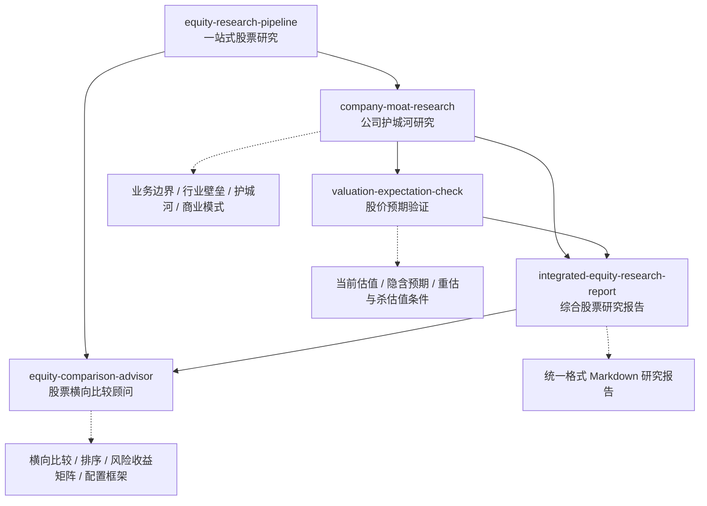

**中文** · [English](./README.en.md)

# Investment Research Skills

#### 投资研究用的 Agent Skills 集合

[](./LICENSE)
[](#-skills)
[](https://agentskills.io)


这里收集的是投资研究场景下可复用的 Agent Skills。每个 skill 都是一个独立的结构化指令集，遵循 [Agent Skills](https://agentskills.io) 开放格式，可被支持 `SKILL.md` 的 Agent 客户端加载。

当前仓库以中文研究输出为主，适合公司研究、行业壁垒分析、护城河判断、竞争对手攻击模拟、财务与商业模式验证等场景。

---

## 目录

| 名字 | 一句话 | 入口 |
| --- | --- | --- |
| [**company-moat-research（公司护城河研究）**](#-company-moat-research公司护城河研究) | 从新进入者、产业研究员、长期投资者三个视角拆解公司护城河和行业进入壁垒 | [SKILL.md](./company-moat-research/SKILL.md) |
| [**valuation-expectation-check（股价预期验证）**](#-valuation-expectation-check股价预期验证) | 检查当前股价隐含的市场预期、兑现难度、估值风险和后续验证指标 | [SKILL.md](./valuation-expectation-check/SKILL.md) |
| [**integrated-equity-research-report（综合股票研究报告）**](#-integrated-equity-research-report综合股票研究报告) | 将护城河研究、估值预期验证和其他投资材料合并成统一格式的 Markdown 研究报告 | [SKILL.md](./integrated-equity-research-report/SKILL.md) |
| [**equity-research-pipeline（一站式股票研究）**](#-equity-research-pipeline一站式股票研究) | 一条指令完成护城河研究、股价预期验证和综合报告生成 | [SKILL.md](./equity-research-pipeline/SKILL.md) |
| [**equity-comparison-advisor（股票横向比较顾问）**](#-equity-comparison-advisor股票横向比较顾问) | 对多家公司研究报告做横向比较、排序和配置决策辅助 | [SKILL.md](./equity-comparison-advisor/SKILL.md) |

---

## 安装

在支持 Skills 的 Agent 里，可以直接让 Agent 安装指定目录：

```text
帮我安装这个 skill：https://github.com/vampire-locker/investment-research-skills/tree/main/company-moat-research
```

也可以手动安装到 Codex。安装单个 skill：

```bash
git clone git@github.com:vampire-locker/investment-research-skills.git
mkdir -p ~/.codex/skills
cp -R investment-research-skills/company-moat-research ~/.codex/skills/
```

安装全部 skills：

```bash
git clone git@github.com:vampire-locker/investment-research-skills.git
mkdir -p ~/.codex/skills
cp -R investment-research-skills/company-moat-research ~/.codex/skills/
cp -R investment-research-skills/valuation-expectation-check ~/.codex/skills/
cp -R investment-research-skills/integrated-equity-research-report ~/.codex/skills/
cp -R investment-research-skills/equity-research-pipeline ~/.codex/skills/
cp -R investment-research-skills/equity-comparison-advisor ~/.codex/skills/
```

Claude Code、OpenCode 等其他客户端请按各自的 skill 导入方式安装所需 skill 目录。

---

## 工作流

这些 skill 可以单独使用，也可以组成完整研究链路：先分析护城河，再验证当前股价隐含预期，最后沉淀为统一格式的 Markdown 报告。也可以直接使用 `equity-research-pipeline` 一条指令跑完全流程；当已经生成多家公司报告后，再用 `equity-comparison-advisor` 做横向比较、排序和配置决策辅助。



---

## ✨ Skills

### company-moat-research（公司护城河研究）

> *“如果我是一个资金充足、执行力很强的新进入者，能不能从 0 开始挑战这家公司？”*

这个 skill 用来研究一家公司所在的行业或细分业务。它不会直接判断“好不好”，而是先把公司放回真实业务系统里，拆解它靠什么赚钱、行业从 0 做起来会卡在哪里、竞争对手怎么进攻，以及这些优势能不能转化为长期利润和现金流。

**它会从三个视角分析**

- **创业者 / 竞争对手**：如果从 0 做同样的生意，最难突破哪些环节。
- **产业研究员**：行业真正的关键资源、稀缺能力和利润来源是什么。
- **长期投资者**：公司是否具备可持续护城河，是否值得长期跟踪或长期持有。

**适合**

- 公司研究和投资备忘录
- 行业进入壁垒分析
- 护城河压力测试
- 竞争对手攻击模拟
- 财务和商业模式验证
- 长期跟踪指标梳理

**怎么触发**

```text
使用 $company-moat-research 分析英伟达所在的 AI 数据中心基础设施业务。

$company-moat-research 分析闪迪，重点看 NAND 行业进入壁垒、数据中心 SSD 机会和长期持有条件。

用公司护城河研究框架分析 Costco，假设我是新进入者，未来 5 年想挑战它。
```

→ [SKILL.md](./company-moat-research/SKILL.md) · [研究框架](./company-moat-research/references/research-framework.md)

### valuation-expectation-check（股价预期验证）

> *“根据前面的分析，如何看待它当前的股价？”*

这个 skill 用来把公司研究、行业研究、财报分析或护城河判断，映射到当前股价和估值预期上。它不回答“买还是卖”，而是拆解当前价格隐含了什么市场预期、这些预期是否和基本面匹配、哪些变量会推动重估或杀估值。

**它会重点回答**

- 当前股价和估值倍数隐含了什么增长、利润率和现金流预期。
- 这些预期和已有基本面分析是否匹配。
- 市场已经计入了什么，可能还没计入什么。
- 什么数据会支持继续重估，什么信号会导致杀估值。
- 接下来最值得跟踪的指标是什么。

**适合**

- 公司研究后的股价追问
- 财报后的估值再评估
- 成长股、周期股、平台公司、重资产公司等不同类型公司的估值预期检查
- 市场隐含预期反推
- 风险收益结构梳理

**怎么触发**

```text
使用 $valuation-expectation-check 分析英伟达当前股价隐含了什么市场预期。

根据前面对闪迪的分析，用 $valuation-expectation-check 看看当前股价是否已经反映 NAND 景气。

这家公司当前估值贵不贵？请不要给买卖建议，只拆解市场预期和后续验证指标。
```

→ [SKILL.md](./valuation-expectation-check/SKILL.md) · [估值框架](./valuation-expectation-check/references/valuation-framework.md)

### integrated-equity-research-report（综合股票研究报告）

> *“把前面的研究整理成一份可以归档的 Markdown 报告。”*

这个 skill 用来把护城河研究、股价预期验证、财报分析或其他投资研究材料，合并成一份结构统一、标题稳定、证据分层清楚的 Markdown 研究报告。它不重新做公司分析或估值分析，而是负责去重、压缩、统一格式和沉淀结论。

**它会重点处理**

- 合并 `company-moat-research` 和 `valuation-expectation-check` 的输出。
- 统一 Markdown 报告标题、顺序和元数据。
- 保留已确认事实、合理推断和待验证假设。
- 去掉重复段落，让护城河结论和估值预期自然衔接。
- 输出适合归档的正式研究报告。

**适合**

- 多轮公司研究后的报告沉淀
- 投资备忘录整理
- 不同 agent 输出格式统一
- 护城河分析和估值预期检查的合并归档
- Markdown 研究报告生成

**怎么触发**

```text
使用 $integrated-equity-research-report 把前面的腾讯护城河分析和估值预期检查整理成一份 Markdown 研究报告。

将上面的 $company-moat-research 和 $valuation-expectation-check 结果合并为正式研究报告。

根据这些研究材料生成一份统一格式的公司研究报告，不要给买卖建议。
```

→ [SKILL.md](./integrated-equity-research-report/SKILL.md) · [报告模板](./integrated-equity-research-report/assets/report-template.md)

### equity-research-pipeline（一站式股票研究）

> *"/equity-research-pipeline 微软"——一条指令，完整研究报告。*

这个 skill 把护城河研究、股价预期验证和综合报告生成串成一条完整流水线。用户只需提供公司名称，skill 会依次完成护城河分析、估值验证和报告沉淀，最终输出一份可归档的 Markdown 研究报告。

**它会依次执行**

1. **护城河研究**：分析业务边界、行业壁垒、护城河来源、商业模式和财务质量。
2. **股价预期验证**：获取最新股价，拆解市场隐含预期，对照护城河基本面。
3. **综合报告生成**：合并两份分析，输出统一格式的 Markdown 研究报告。

**适合**

- 快速建立公司研究档案
- 简化多步骤研究流程
- 批量生成标准格式研究报告
- 不想分三步手动触发的场景

**怎么触发**

```text
使用 $equity-research-pipeline 分析微软。

$equity-research-pipeline 台积电，报告保存到 ~/research/ 目录。

帮我用一站式研究流程分析英伟达，生成完整研究报告。
```

→ [SKILL.md](./equity-research-pipeline/SKILL.md)

### equity-comparison-advisor（股票横向比较顾问）

> *“这些研究报告里，哪些公司更值得优先研究或配置？”*

这个 skill 用来读取多家公司研究报告，提取可比字段，生成表格化的横向比较、排序、风险收益矩阵和条件化配置框架。它适合放在 `equity-research-pipeline` 批量生成报告之后使用。

**它会重点处理**

- 汇总多家公司商业质量、增长确定性、估值压力、风险等级和预期差。
- 用表格、排序表和风险收益矩阵呈现结果。
- 给出优先研究、可分批配置、等待估值消化、小仓位观察、暂列观察等条件化建议。
- 标明买入、等待和重新评估条件。
- 保留数据边界和证据边界，避免无条件买入/卖出建议。

**适合**

- 美股七姐妹等多家公司横向比较
- 多份 Markdown 研究报告汇总
- 组合候选池排序
- 风险收益矩阵和投资者类型匹配
- 买入条件、等待信号和风险信号梳理

**怎么触发**

```text
使用 $equity-comparison-advisor 对 ~/research/magnificent-seven 里的七姐妹研究报告做横向比较。

基于这些研究报告，帮我比较哪些公司更适合优先研究、哪些应该等待估值消化。

用 $equity-comparison-advisor 输出表格化排序、风险收益矩阵和买入条件表。
```

→ [SKILL.md](./equity-comparison-advisor/SKILL.md) · [比较框架](./equity-comparison-advisor/references/comparison-framework.md)

---

## 仓库结构

```text
investment-research-skills/
├── README.md
├── README.en.md
├── LICENSE
├── company-moat-research/
│   ├── SKILL.md
│   ├── agents/
│   │   └── openai.yaml
│   └── references/
│       └── research-framework.md
├── valuation-expectation-check/
│   ├── SKILL.md
│   ├── agents/
│   │   └── openai.yaml
│   └── references/
│       └── valuation-framework.md
├── integrated-equity-research-report/
│   ├── SKILL.md
│   ├── agents/
│   │   └── openai.yaml
│   └── assets/
│       └── report-template.md
├── equity-research-pipeline/
    ├── SKILL.md
    └── agents/
        └── openai.yaml
└── equity-comparison-advisor/
    ├── SKILL.md
    ├── agents/
    │   └── openai.yaml
    └── references/
        └── comparison-framework.md
```

---

## 贡献

欢迎提交新的投资研究类 skill，或改进现有研究框架。建议保持：

- 每个 skill 一个独立目录。
- 每个 skill 至少包含 `SKILL.md`。
- 详细框架放在 `references/` 下。
- 不提交 `.DS_Store`、临时文件、私有资料或未授权数据。

---

[MIT License](./LICENSE) · 自由使用 / 修改 / 再分发
